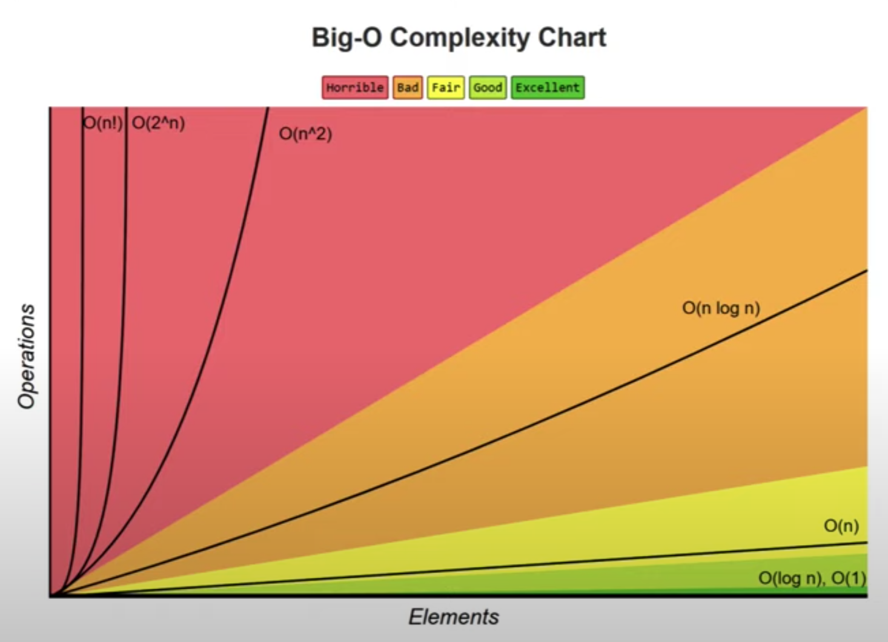

# JavaScript-Algorithms

## Big-O Guide

Calculation not dependent on input size - O(1)

1. single - O(1) [constant]
2. loop - O(n) [linear]
3. nested loops - O(n^2)
4. input size is reduced by half - O(logn)

## Space complexity

O(1) - Constant
O(n) - Linear
O(logn) - Logrithmic

## Big-O Chart



- [Click here to see the chart](https://github.com/umarhamza/JavaScript-Algorithms/blob/main/assets/big-o-chart.png)

## Objects - Big-O

An object is a collection of key value pairs and always have a constant time complexity (except for searching).

- Insert - O(1)
- Remove - O(1)
- Access - O(1)
- Search - O(n)
  - Object.keys()
  - Object.values()
  - Object.entries()

## Array - Big-O

An array is an ordered collection of values. Here are the time complexity for an array.

- Insert / remove at the end - O(1)
- Insert / remove at the beginning - O(n)
- Access - O(1)
- Search - O(n)

### JS array methods

- Push / pop - O(1)
- Shift / unshift / concat / slice / splice - O(n)
- forEach / map / filter / reduce - O(n)

## Tutorial

- [Watch JavaScript Algorithms Playlist](https://www.youtube.com/watch?v=coqQwbDezUA&list=PLC3y8-rFHvwiRYB4-HHKHblh3_bQNJTMa&index=2)

## Algorithm design techniques

### Here's a list of algorithms

#### Brute force

Simple and exhaustive technique that evalutes every possible outcome to find the best solution. Eg: Linear search.

#### Greedy

Choose the best option at the time, without any consideration for the further. Eg. Dijkstra's algorithm, Prim's algorithm and Kruskal's algorithm.

#### Divide and Conquer

Divide the problem into smaller sub-problems. Each sub-problem is then solved and the partial solution is recombined to determine the overall solution. Eg: Binary Search, Quick Sort, Merge Sort and Tower of Hanoi.

#### Dynamic Promming

Divide the problem into smaller sub-problems. Break it down into smaller but overlapping sub-problems. Store the result and reuse it for the same sub-problems. This is called memoisation and is an optimisation technique that improves the time complexity of your algorithm. Eg: Fibonacci numbers and climbing staircase.

#### Backtracking

Generate all possible solutions. Check if solution satisfies all the given constraints and only then you proceed with generating subsequent solutions. If the constrains are not satisfied, backtrack and go on a different path to find the solution. Eg: N-Queens problem.

## Fibonacci sequence

The Fibinacci sequence is a sequence in which each number is the sum of the two proceeding ones.

### Problem (Fibonacci)

Given a number `n`, find the first `n` elements of the Fibonacci sequence.

### Solution (Fibonacci)

To calculate the Fibonacci sequence, you need the following formula: F[n] = F[n - 1] + F[n - 2].

#### Sudo code (Fibonacci)

fib = [0, 1]
loop if `i < n`
fib[i] = fib[i - 1] + fib[i - 2]

#### Approach

- The first two numbers in the sequence are 0 and 1.
- So we can add those values immediately in an array.
- Then create a loop from `index` 2 up to `n` number.
- Now we add a new element into the array at `index` 2 which is the sum of the last two numbers in the array.
- In this case `fib[i - 1]` is 1 in the fib array.
- And `fib[i - 2]` is 0 in the fib array.

#### Code (Fibonacci)

```typescript
const fibonacci = (n: number): number[] => {
  const fib = [0, 1];
  for (let i = 2; i < n; i++) {
    fib[i] = fib[i - 1] + fib[i - 2];
  }
  return fib;
};

console.log(fibonacci(2)); // [0, 1]
console.log(fibonacci(3)); // [0, 1, 1]
console.log(fibonacci(7)); // [0, 1, 1, 2, 3, 5, 8]

// Big-O = O(n)
```

## Factorial

The Factorial of a non-negative number `n` denoted n!, is the product of all positive numbers less than or equal to `n`.

- The Factorial of **zero** is 1.
- The Factorial of **four** is 4 x 3 x 2 x 1 = **24**
- The Factorial of **five** is 5 x 4 x 3 x 2 x 1 = **120**

### Problem (Factorial)

Given an integer `n`, find the that number.

### Solution (Factorial)

- If `n` is zero or one, return 1.
- Loop up from 2 to or equal to `n`
- Multiply each number by the previous value

#### Code (Factorial)

```typescript
const factorial = (n: number): number => {
  let result = 1;
  for (let i = 2; i <= n; i++) {
    result *= i;
  }
  return result;
};

console.log(factorial(0)); // 1
console.log(factorial(4)); // 24
console.log(factorial(5)); // 120

// Big-O = O(n)
```

## Prime Number

A prime number is a natural number greater than 1 that in not a product of two smaller natural numbers.

- Five is a prime number because it can only be expressed as 1 x 5 = 5 and 5 x 1 = 5.
- However Four is not a prime number because it can be represented as as 1 x 4 or 2 x 2 or 4 x 1.

### Problem (Prime Number)

Given a natural number `n`, determine if the number is prime of not.

### Solution (Prime Number)

- Return false if `n` is less than two. Any numbers less than 2 is not a prime number (1, 0, -1 etc).
- If `n` is greater than one, we need to check if it is divisible by any smaller number.
  - If `n` is five, check if five is divisible by four, three, or two
  - Create a for loop that will check from two up to four.
- If the number is divisible by all it's smaller numbers, return false.
- If not, return true outside th loop.

### Sudo code (Prime Number)

`n` < 2 return false
loop `index` of 2 up to `n - 1`
if `n` % `index` is equal to 0 return false
return true

### Code (Prime Number)

```typescript
const isPrime = (n: number): boolean => {
  if (n < 2) return false;
  for (let i = 2; i < n; i++) {
    if (n % i === 0) return false;
  }
  return true;
};

// Big-O = O(n)
```

### Prime Number Square Root

Instead of looping though all the numbers smaller than `n`, we can simply loop till the square root of the number smaller than `n`.

Therefore the Big-O will be: **O(sqrt(n))**

```typescript
const isPrime = (n: number): boolean => {
  if (n < 2) return false;
  for (let i = 2; i <= Math.sqrt(n); i++) {
    if (n % i === 0) return false;
  }
  return true;
};

// Big-O = O(sqrt(n))
```

## Power of Two

**Problem:** Given a positive number `n`, determine if the number is a power of two or not. A number is a power of two if there is a number `x` such that `n === 2x`.

- isPowerOfTwo(1) = true
- isPowerOfTwo(2) = true
- isPowerOfTwo(5) = false

### Sudo Code (Power of Two)

n = 8
8/2 = 4 (remainder 0)
4/2 = 2 (remainder 0)
2/2 = 1 (remainder 0)
If remainder is not 0 in any step, `n` is not a power of two.
If the remainder is 0 and `n` comes down to 1 eventually, `n` is a power of two.

### Code (Power of two)

```typescript
const powerOfTwo = (n: number): boolean => {
  if (n < 1) return false;
  while (n > 1) {
    if (n % 2 !== 0) {
      return false;
    }
    n = n / 2;
  }
  return true;
};

console.log(powerOfTwo(1)); // true
console.log(powerOfTwo(2)); // true
console.log(powerOfTwo(5)); // false

// Big-O = O(logn)
```

## Power of Two (Bitwise)

JavaScript stores numbers as 64 bits floating point numbers, but all bitwise operations are performed on 32 bits binary numbers.

Before a bitwise operation is performed, JavaScript converts numbers to 32 bits signed integers.

After the bitwise operation is performed, the result is converted back to 64 bits JavaScript numbers.

[References](https://www.w3schools.com/js/js_bitwise.asp)

### Table

- 1 & 0 = 0
- 2 & 1 = 0
- 5 & 4 = 4

_There is no loop so the time complexity is constant._

```typescript
const powerOfTwo = (n: number): boolean => {
  if (n < 1) return false;
  return (n & (n - 1)) === 0;
};

console.log(powerOfTwo(1)); // true
console.log(powerOfTwo(2)); // true
console.log(powerOfTwo(5)); // false

// Big-O = O(1)
```

## Recursion

### What?

Recursion is the process by which a function calls itself. It is a problem solving technique where the solution depends on solutions to smaller instances of the same problem.

### Why?

A great technique to simplify your solutions. If you find yourself breaking down your problems into smaller versions of the same problem, then you should likely use recursion.

### A few points

Every recursive solution needs to have a base case - which is a condition to terminate the recursion.

Recursion might simplify solving a problem but it does not always translate to a faster solution. A recursive solution maybe far worse compared to an iterative solution.

## Recursive Fibonacci

The Fibonacci sequence is perfect for recursion. The formula is Fn = Fn-1 + Fn-2.

This is what the recursive solution looks like:

```javascript
const recursiveFibonacci = (n) => {
  if (n < 2) return n;
  return recursiveFibonacci(n - 1) + recursiveFibonacci(n - 2);
};

console.log(recursiveFibonacci(0));
console.log(recursiveFibonacci(1));
console.log(recursiveFibonacci(6));

// Big-O = O(2^n)
```

And this is what the JavaScript call stack looks like:

- fib(2) = fib(1) + fib(0) = 1 + 0 = 1
- fib(3) = fib(2) + fib(1) = 1 + 1 = 2
- fib(4) = fib(3) + fib(2) = 2 + 1 = 3
- fib(5) = fib(4) + fib(3) = 3 + 2 = 5
- fib(6) = fib(5) + fib(4) = 5 + 3 = 8

1. First we calculate `fib(2)` which is equal to `fib(1) + fib(0)`. Due to our base case `fib(1) + fib(0)` becomes `n + n` or `1 + 0` which is equal to `1` Therefore `fib(2)` returns `1`.
2. Then we have `fib(3)` which is equal to `fib(2) + fib(1)`. We already know `fib(2)` returns `1` and `fib(1)` also returns `n` or `1` - hence `fib(3)` returns `1 + 1 = 2`.
3. Next we have `fib(4)` which is equal to `fib(3) + fib(2)`. Looking at the previous examples in the stack - we know it equates to `2 + 1 = 3`.
4. The same logic applies to `fib(5)` which equals to `5`.
5. Lastly we have `fib(6)` which is the final stack. However, this will add all the previous steps back to the stack again and return the same results until we get `3 + 5 = 8`.

## Recursive Factorial

The factorial algorithm is also another problem that is great for recursion.

When using a recursive solution, first break down the problem into smaller versions of the same problem and then idetify the base case for recursion.

### Rethinking Factorial

In order to get an understanding of how we will approach the recursive Factorial problem, we must rethink the way we've previously implemented the Factorial problem. In the previous Factorial problem - we loop up to `n` where `index` begins at `2`. In the new approach, `index` is equal to `n`, then we subtract `1` from `index` until zero.

```javascript
const factorial = (n) => {
  let result = 1;
  for (let i = n; i !== 0; i--) {
    result = result * i;
  }
  return result;
};
```

### Recursion Solution

Keeping this in mind, we will follow a similar principle in the recursive Factorial algorithm by subtracting `1` from `n` (`n - 1`). Then we simply multiply `n` with `n - 1`. This is what the code looks like:

```javascript
const fac = (n) => {
  if (n < 2) return n;
  return n * fac(n - 1);
};
console.log(fac(5));
// Big-O = O(n)
```

## Linear Search Algorithm

Linear Search is an algorithm that searches sequentially starting from one end of the array and goes through each element in the list until it finds the target element.

### Problem (Linear Search)

Given an array of `n` elements and a target element `t`, find the index or `t` in the array. Return -1 if the target element is not found.

### Solution (Linear Search)

The solution is simple:

1. Loop through the array where `index` begins at zero.
2. Check if each element in the array matches the target.
3. If they match, return `index`.
4. If no match is found. Return `-1` outside the loop by default.

### Code (Linear Search)

```javascript
function linearSearch(n, t) {
  for (let i = 0; i < n.length; i++) {
    if (t === n[i]) return i;
  }
  return -1;
}
console.log(linearSearch([-5, 2, 10, 4, 6], 10)); // 2
// Big-O = O(n)
```

### Recursive Linear Search

Looking at the Linear Search algorithm, its really obvious that it can be done recursively. Here is an example below:

```javascript
function lin(a, t, i = 0) {
  if (a[i] === t) return i;
  if (i >= a.length) return -1;
  return lin(a, t, i + 1);
}
console.log(lin([-5, 2, 10, 4, 6], 4));
```

1. We set `i` to zero inside the arguments.
2. Instead of using a loop, we are iteratively increasing `i` by `1` each time we call the `lin()` function.
3. Then we check if the array element matches the target and return `i` if they match.

## Binary Search

Binary Search is a searching algorithm used to locate an item in a **sorted** array by repeatedly dividing the search interval in half. It returns the `index` of the `target` in a _sorted_ array.

The Binary Search will only work with a **sorted** array. If you do not have a sorted array to begin with, you can use Linear Search or sort the array first and then apply Binary Search.

### Problem (Binary Search)

Given a _sorted_ array of `n` elements and a target element (`t`), find the index of `t` in the array. Return `-1` if the target is not found.

### Pseudo Code (Binary Search)

- If the array is empty, return `-1` as the element cannot be found.
- If the array has elements, find the middle element in the array. If the target is equal to the middle element, return the middle element index.
- If the target is less than the middle element, binary search the left half of the array.
- If the target is greater than the middle element, binary search the right half of the array.

### Code (Binary Search)

```javascript
const binarySearch = (arr, target) => {
  let leftIndex = 0;
  let rightIndex = arr.length - 1;

  while (leftIndex <= rightIndex) {
    let middleIndex = Math.floor((leftIndex + rightIndex) / 2);
    if (target === arr[middleIndex]) {
      return middleIndex;
    }
    if (target < arr[middleIndex]) {
      rightIndex = middleIndex - 1;
    } else {
      leftIndex = middleIndex + 1;
    }
  }
  return -1;
};
console.log(binarySearch([-5, 2, 4, 6, 10], 10)); // 4
console.log(binarySearch([-5, 2, 4, 6, 10], 6)); // 3
console.log(binarySearch([-5, 2, 4, 6, 10], 20)); // -1
// Big-O = O(logn)
```

### Solution (Binary Search)

## Next Steps

### Solve more problems

- Finding the GCD using Euclidian algorithm.
- Finding permutations and combinations of a list of numbers.
- Finding the longest common substring in a given string.
- Knapsack problem.

### Watch the JavaScript Data Structures course
